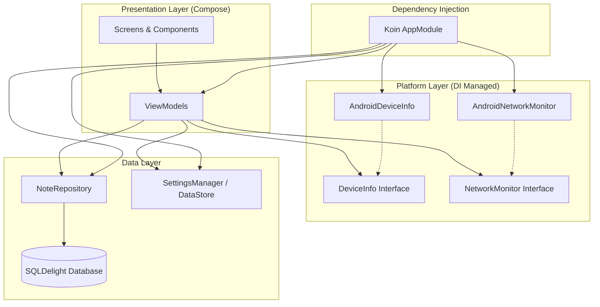

# Notes App - Tugas 8 PAM (Upgrade Platform Features)

A modernized Notes application upgraded with **Dependency Injection (Koin)** and **Platform-Specific Features** using the expect/actual pattern.

## 🚀 Key Upgrades (Tugas 8)
1.  **Koin Dependency Injection**: Full integration of Koin for managing all dependencies (Repository, Database, ViewModels, and Platform Services).
2.  **Platform Features (Expect/Actual)**:
    -   **DeviceInfo**: Accesses hardware manufacturer, model, and Android version.
    -   **NetworkMonitor**: Real-time internet connection tracking using `ConnectivityManager`.
3.  **UI Enhancements**:
    -   **Network Status Indicator**: A dynamic banner on the main screen that appears when the device goes offline.
    -   **Device Info Display**: A new section in the Settings screen showing detailed hardware information.

## 🏗️ Architecture Diagram
The app follows a Clean Architecture approach with Dependency Injection:

## 📸 Screenshots
| Device Info (Settings) | Network Status (Offline Banner) |
|:---:|:---:|
|  |  |

*(Note: Please place the updated screenshots in the `docs/screenshots/` folder)*

## 🎥 Video Demo (45 Seconds)
The video demo covers:
1.  **Dependency Injection**: Showing smooth transitions and state management handled by Koin.
2.  **Device Info**: Navigating to Settings to show hardware details.
3.  **Network Status**: Toggling Airplane Mode/Wifi to show the "Anda sedang offline" banner appearing and disappearing in real-time.

[Watch Video Demo (Demo_Tugas8.mp4)](docs/demo/demo_tugas8.mp4)

## 🛠️ Tech Stack
- **Language**: Kotlin
- **UI**: Jetpack Compose
- **DI**: Koin
- **Database**: SQLDelight
- **Local Settings**: Jetpack DataStore
- **Architecture**: MVVM + Clean Architecture principles

---
**Tugas 8 - Pemrograman Aplikasi Mobile (PAM)**
*Teknik Informatika - Institut Teknologi Sumatera (ITERA)*
