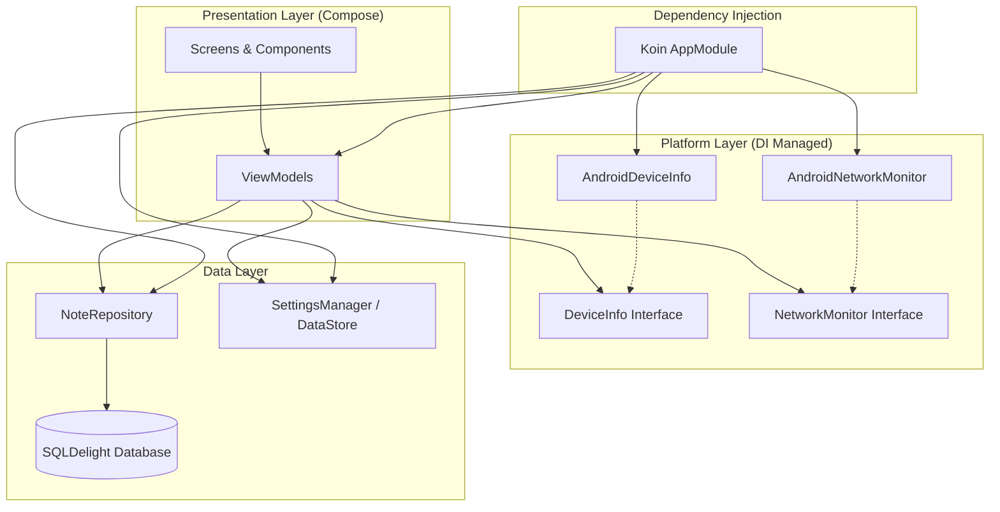

# Notes App - Tugas 8 PAM (Upgrade Platform Features)

Aplikasi Catatan modern yang telah ditingkatkan dengan **Dependency Injection (Koin)** dan **Fitur Spesifik Platform** menggunakan pola *expect/actual*.

## 🚀 Key Upgrades (Tugas 8)
 1.  **Koin Dependency Injection**: Integrasi penuh Koin untuk mengelola semua dependensi (Repository, Database, ViewModel, dan Layanan Platform).
 2.  **Fitur Platform (Expect/Actual)**:
     -   **DeviceInfo**: Mengakses informasi manufaktur, model, dan versi Android perangkat.
     -   **NetworkMonitor**: Pemantauan koneksi internet secara real-time menggunakan `ConnectivityManager`.
 3.  **Peningkatan UI**:
     -   **Indikator Status Jaringan**: Banner dinamis di layar utama yang muncul secara otomatis saat perangkat sedang offline.
     -   **Tampilan Info Perangkat**: Bagian baru di layar Pengaturan (Settings) yang menampilkan detail perangkat keras.

## 🏗️ Architecture Diagram
Aplikasi ini menggunakan pendekatan Clean Architecture dengan Dependency Injection:

## 📸 Screenshots
| Device Info (Settings) | Network Status |
|:---:|:---:|
|  |  |

## 🎥 Video Demo (45 Seconds)
The video demo covers:
1. **Dependency Injection**: Menunjukkan transisi yang mulus dan manajemen state yang ditangani oleh Koin.
2. **Info Perangkat**: Menavigasi ke menu Settings untuk menunjukkan detail perangkat keras.
3. **Status Jaringan**: Mengaktifkan/menonaktifkan Mode Pesawat atau Wifi untuk menunjukkan banner "Anda sedang offline" yang muncul dan hilang secara real-time.

https://github.com/user-attachments/assets/e2d71a9f-8620-4b79-afad-717556062449

## 🛠️ Tech Stack
- **Language**: Kotlin
- **UI**: Jetpack Compose
- **DI**: Koin
- **Database**: SQLDelight
- **Local Settings**: Jetpack DataStore
- **Architecture**: MVVM + Clean Architecture principles

---
