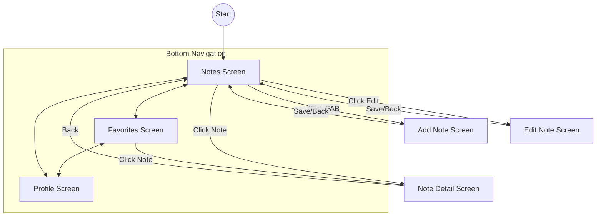

# Notes App - Tugas PAM Minggu 5

Aplikasi Catatan sederhana yang dibangun menggunakan Jetpack Compose dengan fitur navigasi lengkap.

## Fitur
1. **Bottom Navigation**: 3 Tab utama (Notes, Favorites, Profile).
2. **Note List to Detail**: Navigasi ke detail catatan dengan pengiriman ID.
3. **Add Note**: Navigasi menggunakan Floating Action Button (FAB).
4. **Edit Note**: Fitur edit catatan dengan passing argument `noteId`.
5. **Back Navigation**: Implementasi navigasi balik yang proper di semua layar.
6. **Favorites**: Menyaring catatan yang ditandai sebagai favorit.

## Struktur Folder
Sesuai instruksi, proyek ini diorganisir sebagai berikut:
- `navigation/`: Berisi definisi rute dan `Screen` class.
- `screens/`: Berisi semua layar utama aplikasi (Notes, Detail, Add/Edit, Profile).
- `components/`: Berisi komponen UI yang dapat digunakan kembali (seperti `NoteItem`).
- `data/`: Model data dan state UI.
- `viewmodel/`: Logic aplikasi dan state management.

## Diagram Alur Navigasi (Navigation Flow)

## Screenshots

| Notes Screen | Favorites Screen | Profile Screen |
|--------------|------------------|----------------|
|  |  |  |

| Add/Edit Screen | Note Detail |
|-----------------|-------------|
|  |  |

## Video Demo
[Klik di sini untuk melihat video demo (30 detik)](video/demo.mp4)

---
**Branch**: `week-5`
**Mahasiswa**: Gilang Surya Agung
**NIM**: 123140187
